# ilastik ImageJ modules

[](https://github.com/ilastik/ilastik4ij/actions/workflows/build-main.yml)

_(c) Carsten Haubold, Adrian Wolny, Image Analysis and Learning Lab, HCI/IWR, University of Heidelberg._

This repository contains ImageJ2 plugins that wrap ilastik workflows for usage in [ImageJ](https://imagej.net) 
and [KNIME](https://www.knime.com). Data transfer is managed through temporary HDF5 file export/import, which can also be performed individually.
The ilastik workflows are invoked by running the ilastik headless mode from the command line.

Currently, three workflows are wrapped: Pixel classification, Autocontext, Object classification, Boundary-based Segmentation with Multicut, and tracking.
There is one additional setting showing up in the ImageJ menu, which configures the location of the ilastik binary.

## Contents

* [Installation](#installation)
* [User documentation](#user-documentation)
    - [General](#general)
    - [Import](#import)
    - [Export](#export)
    - [How to train an ilastik project to be used with those wrappers](#how-to-train-an-ilastik-project-to-be-used-with-those-wrappers)
    - [ilastik configuration for the workflow wrappers](#configuration)
    - [Pixel Classification and Autocontext](#pixel-classification-and-autocontext)
    - [Object Classification](#object-classification)
    - [Boundary-based Segmentation with Multicut](#boundary-based-segmentation-with-multicut)
    - [Tracking](#tracking)
    - [Usage in KNIME](#usage-in-knime)
* [Developer documentation](#developer-documentation)
    - [Deployment](#deployment)

## Installation

Within ImageJ/Fiji you can install the plugin via the `Help -> Update` menu and select the `ilastik Import Export` site.

**Note**: The plugins need Java 1.8, if you see error messages popping up that might be caused by an older Java version.

**Compatibility note:**: We try to keep the plugin backwards compatible. Some versions of ilastik are _not_ compatible with the current plugin: `1.3.3b2`,  `1.3.3rc2`, `1.3.3`, `1.3.3post1`, `1.3.3post2`. _We recommend to update to the latest stable version!. If you need to stick with `1.3.3x` for some reason, please use `1.3.3post3`._

## User documentation

The ilastik workflow wrappers, as well as importer and exporter, can be found in ImageJ under `Plugins -> ilastik`, 
or in KNIME in the `Community Contributions -> KNIME Image Processing -> ImageJ2 -> Plugins -> ilastik`.

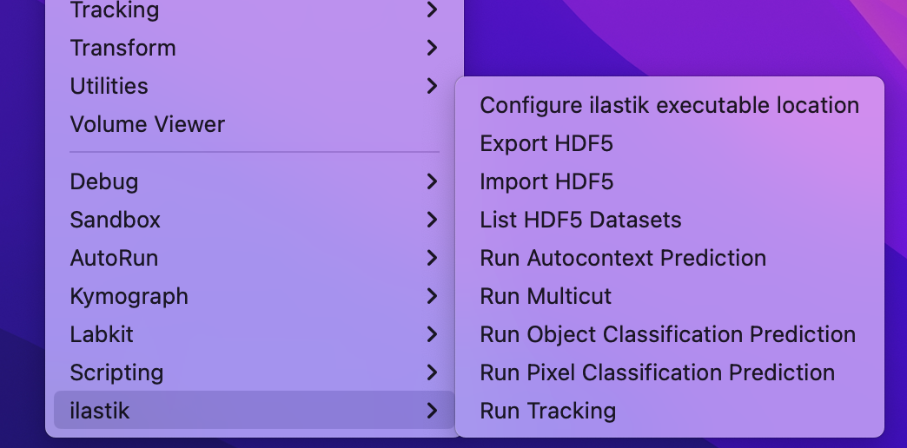

### General

All Plugins output status information to log files, so we suggest to keep an eye at the ImageJ `Windows -> Console`.

All workflow wrappers have the option to produce only the input files, so that you can use those to train an ilastik project. 
See the [Training](#how-to-train-an-ilastik-project-to-be-used-with-those-wrappers) section for more details.

### Import

Found at `Plugins -> ilastik -> Import HDF5`.

HDF5 files can contain multiple datasets. Thus, when you import an HDF5 file containing more than one dataset, 
you will have to select which dataset you want to import. After choosing a given HDF5 file, you will be presented with the following dialog:

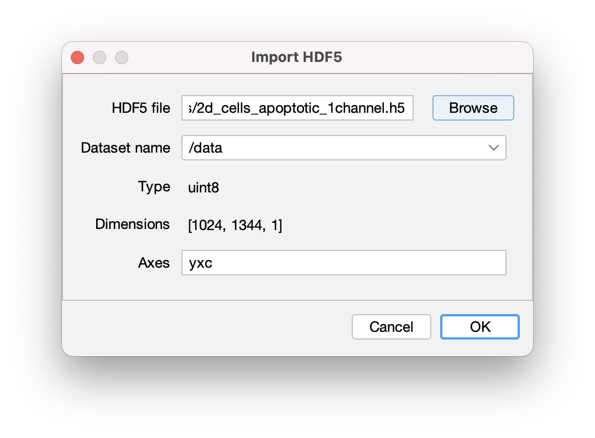

where you should select or enter the correct meaning of the different dimensions of the dataset. 
At least `x` and `y` must be present, and the number of characters (`x`,`y`,`z` spatial, `c` channels and `t` time)
must be equal to the number of dimensions listed in the description above.

#### Batch processing

The macro below demonstrates how to import many `.h5` files that were generated with ilastik using a macro:

```
dataDir = "<DATASET_DIR>";
fileList = getFileList(dataDir);
for (i = 0; i < fileList.length; i++) {
	// import image from the H5
	fileName = dataDir + fileList[i];	
	importArgs = "select=" + fileName + " datasetname=" + inputDataset + " axisorder=" + axisOrder; 			
	run("Import HDF5", importArgs);
}
```


### Export

Found at `Plugins -> ilastik -> Export HDF5`.

If you want to save the currently opened image to a HDF5 file that can be immediately opened in ilastik,
use this export option. Additionally to the location where the file should be saved, you could specify the output
data set name as well as how much the dataset should be compressed.
Use `0` for raw data because it doesn't compress well, but `9` for segmentations etc, where many pixel values are equal.
The plugin uses (lossless) gzip compression.

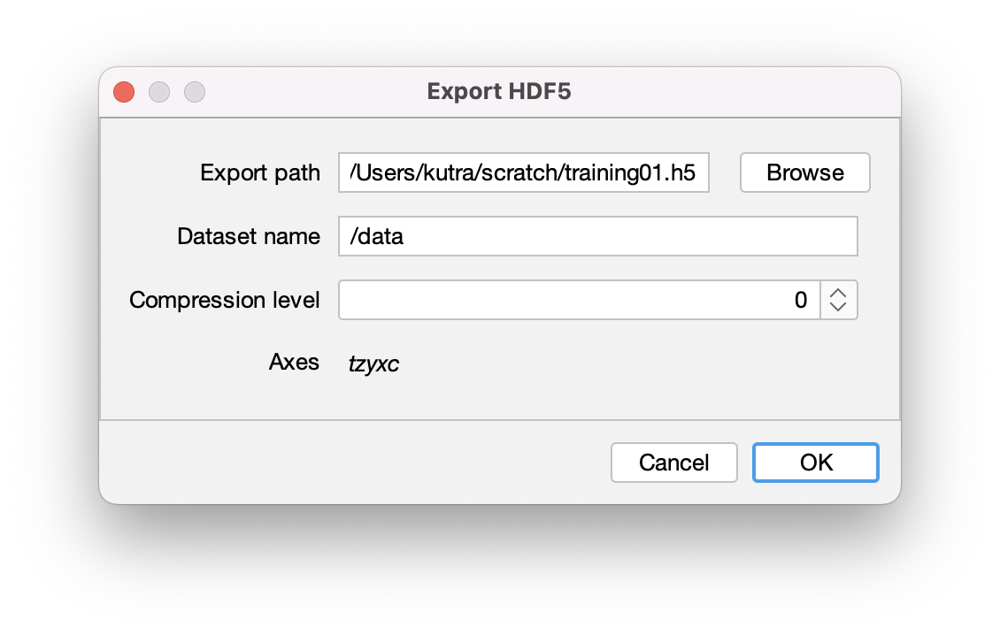

### How to train an ilastik project to be used with those wrappers

For the workflow wrappers below, it is important that ilastik projects are trained from data that was 
preprocessed and exported the same way as all further datasets will be. There are two ways how this can be achieved with this plugin:

1. You can manually use the export option as described [above](#export) to export your images from ImageJ to an ilastik-compatible 
   HDF5 dataset with 5 dimensions. Then when you create an ilastik project, read the raw data / probabilities / segmentation from the exported HDF5 files.
2. Each workflow wrapper has a `Save temporary file for training only, no prediction` option. If you select this option and run the plugin, 
   the input files -- that would otherwise be passed to ilastik -- are exported to temporary files. 
   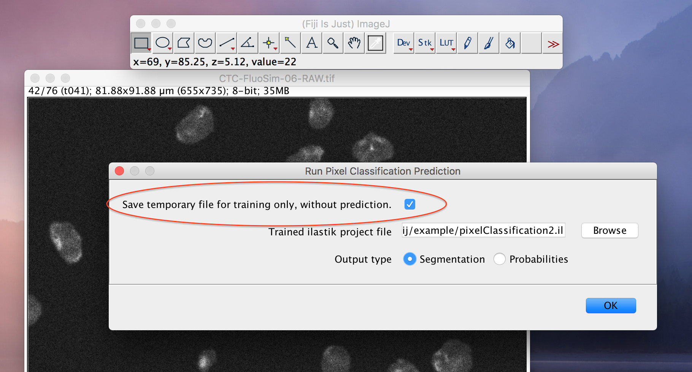
   The locations and names of those files are written to ImageJ's console, which you should open using `Window->Console`.
   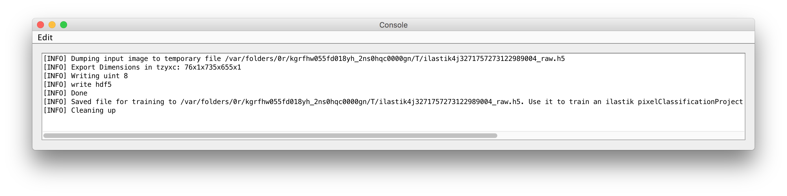
   Use this file as input in your ilastik project. Then processing any further files from ImageJ through the ilastik workflow wrappers
   should give the desired results.

### ilastik configuration of the workflow wrappers
Found at `Plugins -> ilastik -> Configure ilastik executable location`.

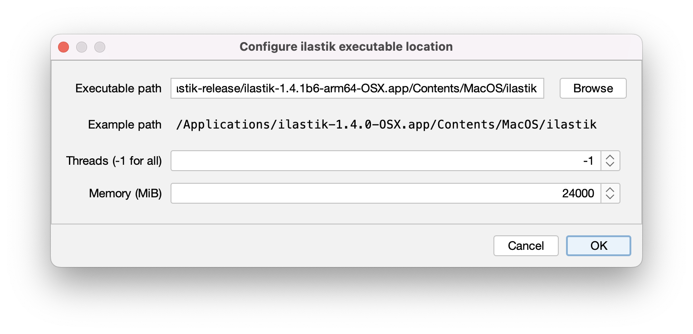

* Path to ilastik executable: choose the location of your ilastik binary executable
* Number of threads to use (-1 for no limit)
* Specify an upper bound of RAM that ilastik is allowed to use

### Pixel Classification and Autocontext

Pixel Classification and Autocontext workflow have similar input settings.

The Pixel Classification Workflow can be found at `Plugins -> ilastik -> Run Pixel Classification Prediction`, the Autocontext Workflow at `Plugins -> ilastik -> Run Autocontext Prediction`.

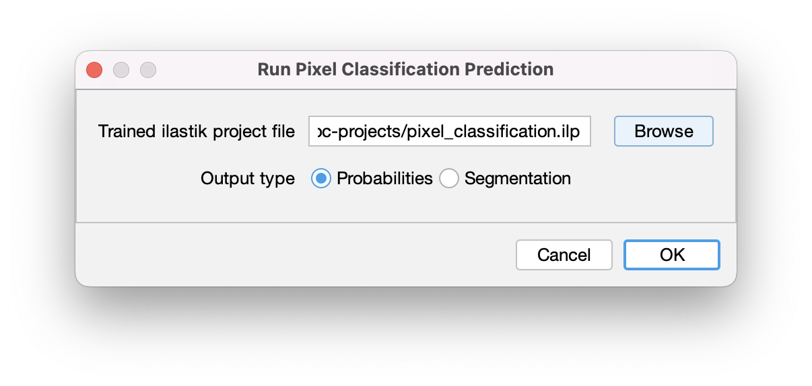

**Inputs:** 

* a raw image on which to run the pixel classification (if only one is opened, there is no selection in the dialog) 
  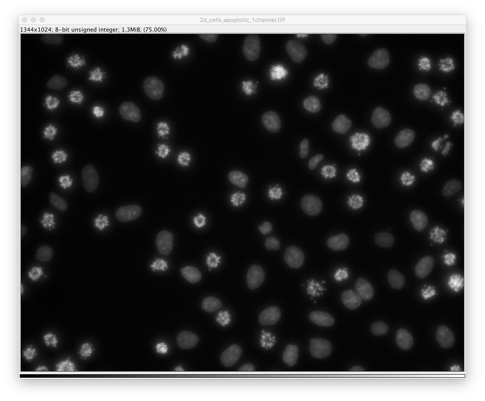
* a project file
* whether to produce per-pixel probabilities, or a segmentation

**Output:**

* if _Probabilities_ was selected: a multi-channel float image that you can _e.g._ threshold to obtain a 
  segmentation 
* or a _Segmentation_:a single-channel image where each pixel gets a value corresponding to an _object ID_ inside a _connected component_.
It is recommended to apply a LUT (e.g. `Image -> Lookup Tables -> glasbey`) to the result in order to see the _segmentation_ output. 
  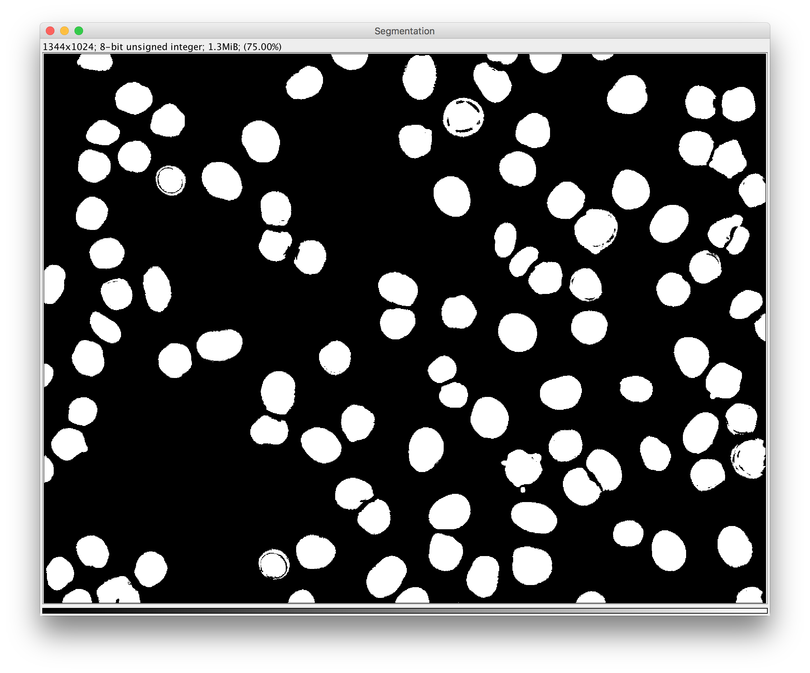.
  
#### Batch processing
The macro below demonstrates how to apply pixel classification to all HDF5 files in a given input directory and save
resulting probability maps in separate HDF5 files inside the input directory.
```
// set global variables
pixelClassificationProject = "<ILASTIK_PROJECT_PATH>";
outputType = "Probabilities"; //  or "Segmentation"
inputDataset = "data";
outputDataset = "exported_data";
axisOrder = "tzyxc";
compressionLevel = 0;

// process all H5 files in a given directory
dataDir = "<DATASET_DIR>";
fileList = getFileList(dataDir);
for (i = 0; i < fileList.length; i++) {
	// import image from the H5
	fileName = dataDir + fileList[i];	
	importArgs = "select=" + fileName + " datasetname=" + inputDataset + " axisorder=" + axisOrder; 			
	run("Import HDF5", importArgs);

	// run pixel classification
	inputImage = fileName + "/" + inputDataset;
	pixelClassificationArgs = "projectfilename=" + pixelClassificationProject + " saveonly=false inputimage=" + inputImage + " pixelclassificationtype=" + outputType;
	run("Run Pixel Classification Prediction", pixelClassificationArgs);

	// export probability maps to H5
	outputFile = dataDir + "output" + i + ".h5";
	exportArgs = "select=" + outputFile + " datasetname=" + outputDataset + " compressionlevel=" + compressionLevel;
	run("Export HDF5", exportArgs);
}
```
replace `<DATASET_DIR>` with the input dataset where the HDF5 files reside (don't forget the trailing slash `/`) and `<ILASTIK_PROJECT_PATH>` with the path to your ilastik Pixel Classification project file.

### Object Classification
Found at `Plugins -> ilastik -> Run Object Classification Prediction`.

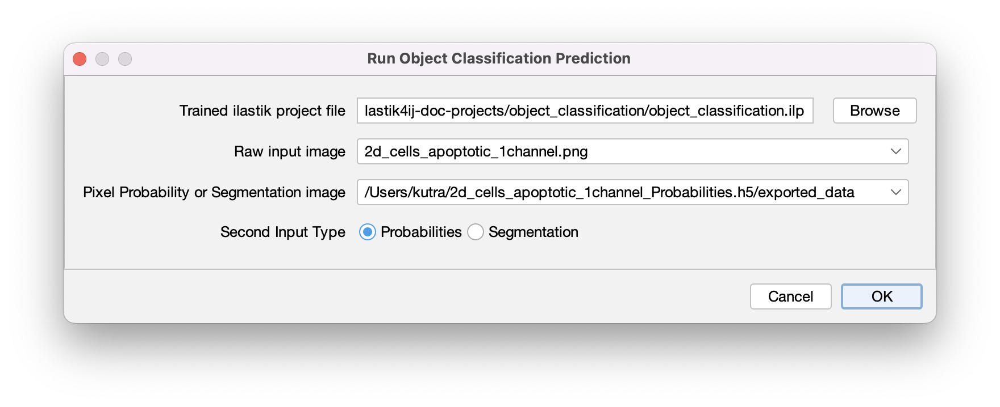

**Inputs:** 

* a project file
* one raw image (select the appropriate one in the dropdown box as shown above)
* one additional image that contains either per-pixel probabilities or a segmentation
* select the appropriate input type (_Probabilities_ or _Segmentation_)

**Output:**

* a new image where the pixels of each object get assigned the value that corresponds to the class that was predicted for this object. 
  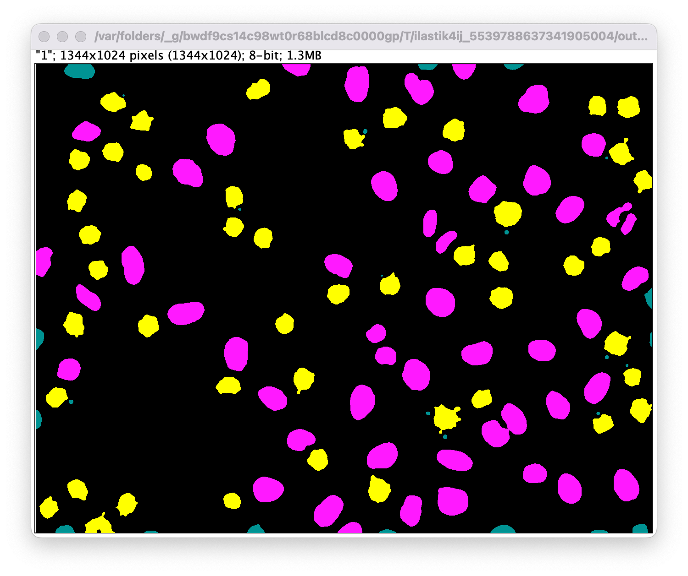


### Boundary-based Segmentation with Multicut
Found at `Plugins -> ilastik -> Run Multicut`.

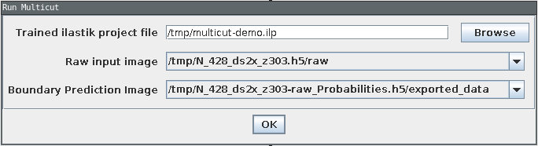

**Inputs:**

* a project file
* one raw image (select the appropriate one in the dropdown box as shown above)
* one additional image that contains boundary probabilities. Those can be generated, e.g. in Pixel Classification or with a pre-trained Neural Network.

**Output:**

* a new integer value image (label image) where the pixels belonging to the same object have the same value.
  The example image below shows (left to right) raw data, boundary probability map, and multicut segmentation result (with applied LUT).
  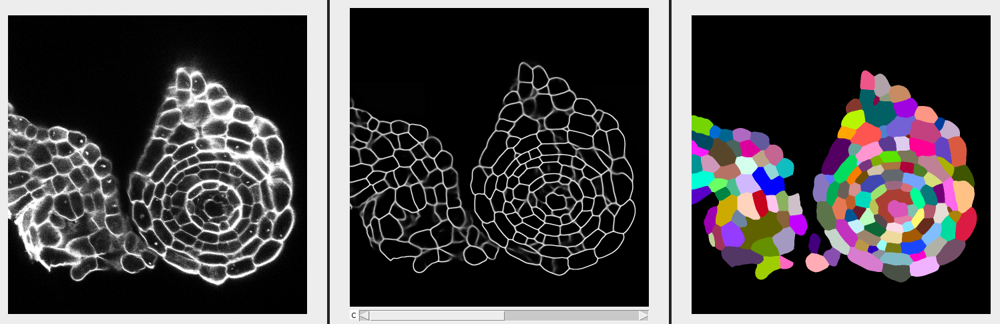


### Tracking
Found at `Plugins -> ilastik -> Run Tracking`.

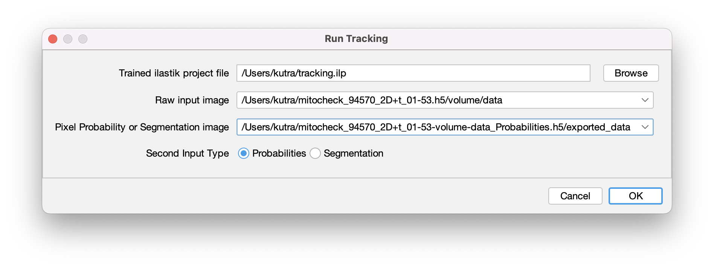

**Inputs:** 

* a project file
* one raw image (with a time axis!) 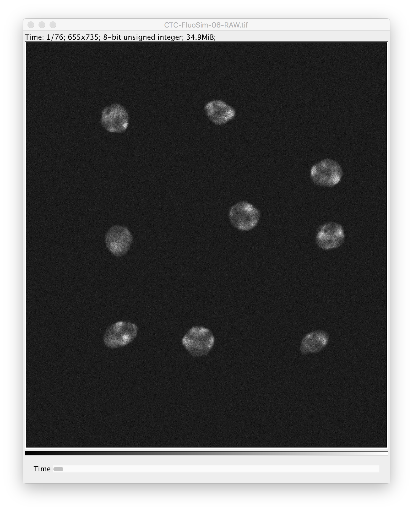
* one additional image that contains either per-pixel probabilities or a segmentation with the same dimensions as the raw image. 
  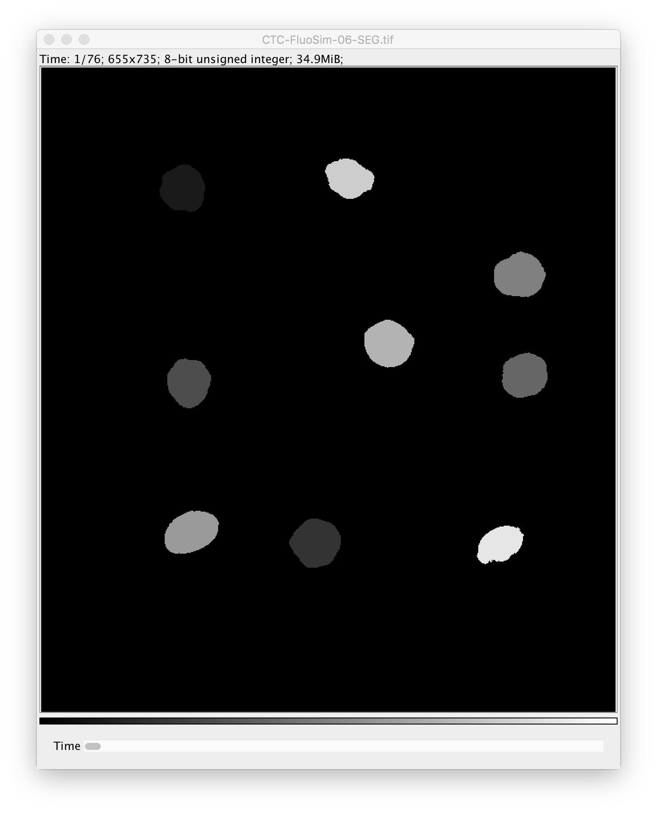
* select the appropriate input type (_Probabilities_ or _Segmentation_)

**Output:**

* a new image stack where the pixels of each object in each frame get assigned the value that
  corresponds to the _lineage ID_ of the tracked object. Whenever an object enters the field of view
  it will be assigned a new _lineage ID_. All descendants of this object will be assigned the same
  _lineage ID_. 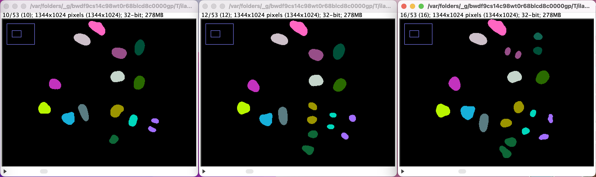

### Usage in KNIME

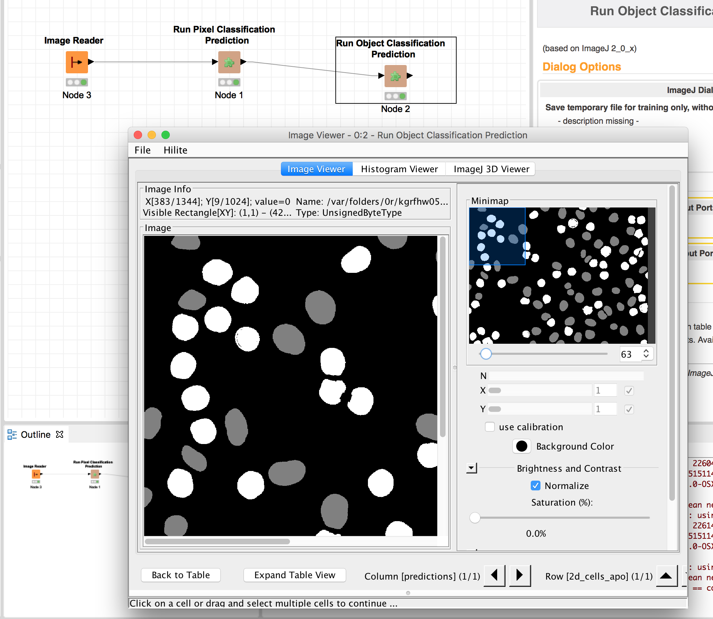

## Developer documentation

The workflow wrappers are ImageJ2 plugins (see https://imagej.net/Writing_plugins), annotated with
`@Plugin` for automated discovery by the _scijava_ plugin architecture, and derived from `Command`
to be an executable item. Each command can have multiple `@Parameter`s, which are to be provided by
the user in an auto-generated GUI (see https://imagej.net/Script_Parameters for a list of which
parameters are allowed). One can have multiple `Dataset`s as input parameters, but the output should
be an `ImgPlus` (an ImageJ2 datastructure wrapping an [ImgLib2](https://imagej.net/ImgLib2) `Img`
with metadata) so that the result pops up as new window. A `Dataset` is a wrapper around an
`ImgPlus`.

**Attention:** there are ImageJ 1 and ImageJ 2 containers for images. In ImageJ 1, images were stored
as `ImagePlus`, containing `ImageProcessors` to access the underlying data. We try to use ImageJ 2
containers everywhere which are roughly wrapped as `Dataset > ImgPlus > Img >
RandomAccessibleInterval`.

**Testing:** no real tests are included right now, but you can run the `main` method in
`WorkflowTests.java` which fires up an ImageJ instance for each of the three plugins.

### Deployment

We follow the setup of other `scijava` modules and use their Travis setup that allows us to
automatically deploy Maven artifacts (built modules) as explained [here](https://imagej.net/Travis).
The project configuration, including dependencies, is contained in the `pom.xml` file. To create a
new release, use the `release-version.sh` script from https://github.com/scijava/scijava-scripts,
which goes a long way of ensuring that the project is ready to be published. Once it is released,
the nightly build of KNIME Image Processing (KNIP) will pick it up and wrap it as well.
